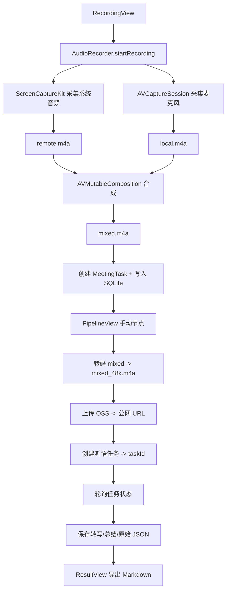

# 架构总览

## 文档目的

解释应用从 UI 到录音、流水线处理、数据持久化与云端集成的整体结构，方便后续迭代与排障。

## 范围 / 非目标

- 范围：macOS 端从录音到拿到听悟结果的完整链路。
- 非目标：阿里云服务端的内部实现细节。

## 目录结构

- `Sources/WeChatVoiceRecorder/`
  - `WeChatVoiceRecorderApp.swift`：应用入口与 AppDelegate（激活策略）。
  - `ContentView.swift`：应用骨架、导航与状态装配。
  - `AudioRecorder.swift`：双轨录音与本地合成。
  - `Models/MeetingTask.swift`：任务模型与状态机。
  - `Services/`
    - `SettingsStore.swift`：配置、功能开关、日志。
    - `KeychainHelper.swift`：Keychain 密钥存储（RAM AK/Secret）。
    - `OSSService.swift`：上传合成音频到 OSS。
    - `TingwuService.swift`：创建听悟离线任务 + 查询任务信息。
    - `MeetingPipelineManager.swift`：串联转码/上传/创建/轮询并写入数据库。
    - `DatabaseManager.swift`：SQLite 任务持久化。
    - `HistoryStore.swift`：历史列表的 Observable 包装。
  - `Views/`：SwiftUI 界面（录音、流水线、结果、设置、历史）。

## 运行时组件

- UI 层（SwiftUI）
  - `ContentView` 使用 `NavigationSplitView`：
    - 左侧：`HistoryView` + “New Recording”
    - 右侧：根据选择展示 `RecordingView` 或 `ResultView`
  - `RecordingView` 内嵌 `PipelineView` 展示最新任务的流水线操作。
- 领域模型
  - `MeetingTask` 表示一次录音及其云端处理生命周期。
- 存储
  - `DatabaseManager` 通过 SQLite 保存任务，跨启动保留历史。
- 云端
  - OSS 用于文件托管，听悟用于转写与总结。

## 高层流程

## 状态机

定义在 `Models/MeetingTask.swift`：

- `recorded`：本地合成完成并创建任务
- `transcoding` → `transcoded`
- `uploading` → `uploaded`
- `created`：流水线中用于“创建任务中”的临时状态
- `polling` → `completed`
- `failed`：任一步骤失败

## 依赖

在 `Package.swift` 中声明：

- `ScreenCaptureKit` + `AVFoundation`：音频采集与导出。
- `SQLite.swift`：本地持久化。
- `alibabacloud-oss-swift-sdk-v2`：OSS 上传。
- `CryptoKit`：听悟请求签名（ACS3-HMAC-SHA256）。

